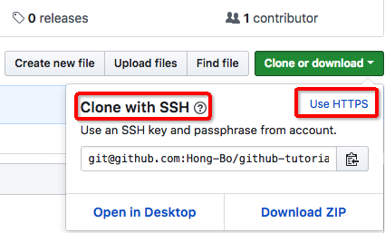

# Minimum Git
This document is a minimum tutorial for using git. It covers the most practical and fundamental usages of git, especially topics related to repositories and branches.

## 0. Getting Started

### Prerequisites

There are several things that need to be done in advance:

1. Create an account at [GitHub](https://pages.github.com/)

2. Get a computer, Mac/Linux/Windows

## 1. Set up your Git

You can set up your email address and username locally or globally, which means setting them up for a single repository or for every repository on your computer.

### 1.1. Locally

1. Open Terminal.

2. Change the current working directory to the local repository where you want to configure the name that is associated with your Git commits.

3. Set your email address and username:

```
git config user.email "john.snow@example.com"
git config user.name "John Snow"
```

4. Confirm that you have set the Git username correctly:

```
git config user.email 
git config user.name
```

### 1.2. Globally

1. Open Terminal.

2. Set your email address and username:

```
git config --global user.email "john.snow@example.com"
git config --global user.name "John Snow"
```

3. Confirm that you have set the Git username correctly:

```
git config --global user.email 
git config --global user.name
```

## 2. Create a repository

A repository can be created in several ways:

### 2.1. Using GitHub

You can create a repository on GitHub following the simple creation instructions. Do not forget initializing your repository with a README.

### 2.2. From local files using cmd lines

More than often, you have developed some parts of a project before you realize that you want to put it on GitHub. Is it a little late? Don't worry. You can put your files on GitHub anytime you want.

Suppose you have a folder like this
```
/hello
    say_hello.py
```
Following the instructions below, you can create the repository you need.

1. [Generate a new SSH key](https://help.github.com/articles/generating-a-new-ssh-key-and-adding-it-to-the-ssh-agent/)

2. [Add it to you GitHub Account](https://help.github.com/articles/adding-a-new-gpg-key-to-your-github-account/)

3. Open terminal and change into the working directory

4. Initilize the local directory as a Git repository

```
$ git init
```

5. Add the files to your new local repository

```
$ git add .
```

6. Commit the files that you've staged in your local repository

```
$ git commit -m "Repository Created"
```

7. Create an empty repository on GitHub and copy the remote repository URL

8. In Terminal, add the URL for the remote repository where your local repository will be pushed
```
$ git remote add origin [paste copied URL here]
```

9. Push the changes in your local repository to GitHub
```
$ git push -u origin master
```

## 3. Authenticate with GitHub from Git When Cloning

When you connect to a GitHub repository from Git, you'll need to authenticate with GitHub using either HTTPS or SSH. Click [this link](https://help.github.com/articles/which-remote-url-should-i-use/) if you are not farmiliar with these two kinds of connecting methods.



### 3.1 Connecting over HTTPS

If you clone with HTTPS, you can cache your GitHub password in Git using a credential helper.

1. Find out if Git and the osxkeychain helper are already installed:

```
git credential-osxkeychain
```

2. Tell Git to use osxkeychain helper using the global credential.helper config:

```
git config --global credential.helper osxkeychain
```

The next time you clone an HTTPS URL that requires a password, you'll be prompted for your username and password, and to grant access to the OSX keychain. After you've done this, the username and password are stored in your keychain and you won't be required to type them in to Git again.

### 3.2 Connecting over SSH

If you clone with SSH, you must generate SSH keys on each computer you use to push or pull from GitHub.

1. Open terminal

3. [Add your SSH public key to you GitHub Account](https://help.github.com/articles/adding-a-new-gpg-key-to-your-github-account/)

## 4. Create/Delete a branch

### 4.1 On GitHub

You can create or delete branches directly on GitHub, simply following the instructions.

### 4.2 Create a new branch using cmd lines
1. Create the branch on your local machine and switch in this branch
```
$ git checkout -b [new_branch_name]
```
2. Push the branch on github :
```
$ git push origin [new_branch_name]
```

### 4.3 Delete a branch using cmd lines

1. Delete a branch on your local filesystem (checkout first):

```
$ git branch -d [branch_name]
```

2. Delete the branch on github :

```
$ git push origin :[branch_name]
```

## 5. Practice 

1. Create a repository from local files

2. Remove local files

3. Clone the repository using https

4. Set up your email and username locally

5. Authenticate the cloned repository using osxkeychain

6. Change some codes and push them to remote repository

7. Now that git has remembered your name and password, make another change and push it to remote repository

8. Create a new branch using terminal

9. Change some codes and push the change to remote repository using the new branch

10. Merge the change into master branch using the frontend of Github

11. Delete the created branch using terminal

Congratulations!!! You have succeeded in managing Git!

## Authors

* **Hong-Bo Deng** - *Initial work* - [Hong-Bo](https://github.com/Hong-Bo)
